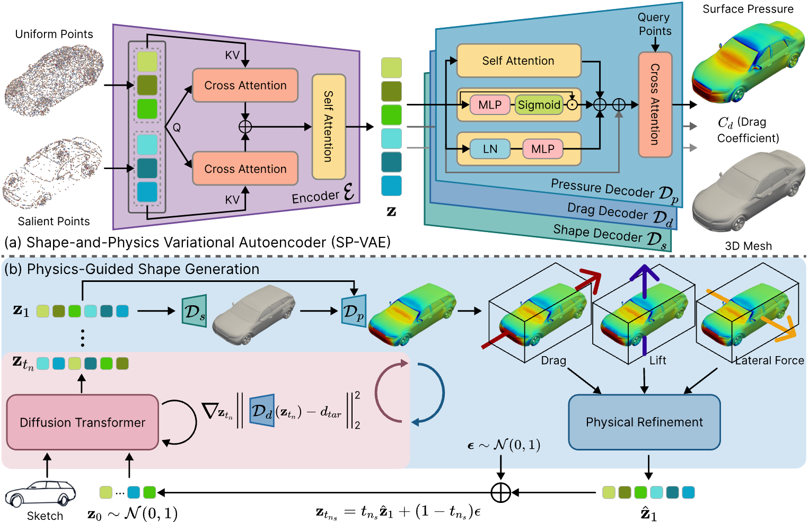

# PhysGen
[📄 Paper](https://arxiv.org/pdf/2512.00422) · [📚 arXiv](https://arxiv.org/abs/2512.00422) · [💻 Code](https://github.com/kasvii/PhysGen)

**PhysGen: Physically Grounded 3D Shape Generation for Industrial Design**  
*Accepted to CVPR 2026*

<p align="center">
  
</p>

<p align="center">
  <video src="assets/demo1.mp4" autoplay muted loop playsinline width="48%"></video>
  <video src="assets/demo2.mp4" autoplay muted loop playsinline width="48%"></video>
</p>

---

## Overview

PhysGen is a physics-grounded 3D shape generation framework for industrial design. It jointly models geometry and physical properties in a shared latent space and enables physics-guided generation for both unconditional and conditional settings.

This repository includes:

- training and evaluation code for the **Shape-Physics Variational Autoencoder (SP-VAE)**
- training and inference code for **physics-guided flow matching model**
- preprocessing scripts for the **DrivAerNet++** dataset
- pretrained checkpoints for reproduction

---

## Preparation

### 1. Environment Setup

This project is developed and tested on NVIDIA A100/H100 GPUs. We recommend using an Anaconda environment.
```bash
git clone https://github.com/kasvii/PhysGen.git
cd PhysGen

conda create -n physgen python=3.10 -y
conda activate physgen
conda install -y pytorch=2.4.0 torchvision=0.19.0 torchaudio=2.4.0 pytorch-cuda=12.1 -c pytorch -c nvidia
pip install -r requirements.txt
```

---

### 2. Download Pretrained Models

To download the pretrained checkpoints, run:

```bash
bash commands/download_pretrained_models.sh
```

The checkpoints will be saved under `./outputs/`.

---

### 3. Download and Prepare the Dataset

Please follow the official [DrivAerNet++ dataset instructions](https://github.com/Mohamedelrefaie/DrivAerNet?tab=readme-ov-file#-dataset-access--download) to download the data from [Harvard Dataverse](https://dataverse.harvard.edu/dataverse/DrivAerNet).

Specifically:

#### Drag values
Download [Drag Values](https://www.dropbox.com/scl/fi/2rtchqnpmzy90uwa9wwny/DrivAerNetPlusPlus_Cd_8k_Updated.csv?rlkey=vjnjurtxfuqr40zqgupnks8sn&st=6dx1mfct&dl=0) and place it at:

```bash
./data/drivaernet_plus/drag/DrivAerNetPlusPlus_Cd_8k_Updated.csv
```

#### 3D meshes
Download **DrivAerNet++: 3D Meshes**, extract all `.stl` files into:

```bash
./data/drivaernet_plus/meshes/3DMeshesSTL
```

Then preprocess them with:

```bash
cd preprocess
bash extract_data.sh
```

#### Pressure fields
Download **DrivAerNet++: Pressure** and extract all `.vtk` files into:

```bash
./data/drivaernet_plus/pressure/PressureVTK
```

#### Sketch conditions
Download **DrivAerNet++: Sketches / sketches-CLIPasso.zip** and extract it into:

```bash
./data/drivaernet_plus/condition/matched_sketches-CLIPasso
```

---

## Shape-Physics Variational Autoencoder (SP-VAE)

Training SP-VAE consists of two stages: **independent training** and **joint training**.

### Stage 1: Independent Training

You may skip this stage if you use the provided pretrained checkpoints in `./outputs/ShapeVAE`, `./outputs/PhysDec`, and `./outputs/DragDec`.

To train your own model, run:

```bash
# Shape encoder and decoder
bash commands/train_shapeautoencoder_single_node.sh

# Pressure decoder
bash commands/train_physdec_single_node.sh

# Drag decoder
bash commands/train_dragdec_single_node.sh
```

---

### Stage 2: Joint Training

You may skip this stage if you use the provided pretrained checkpoints in `./outputs/FinetuneAll`.

If you want to use your own Stage-1 checkpoints, please set the checkpoint paths in `configs/MultiTaskJoint.yaml`:

```yaml
# lines 43-45
shape_model_ckpt: [path to your ShapeVAE checkpoint]
physics_model_ckpt: [path to your PhysDec checkpoint]
drag_model_ckpt: [path to your DragDec checkpoint]
```

To train your own model, run:

```bash
# training
bash commands/train_totalvae_single_node.sh

# testing
# set the checkpoint paths in configs/MultiTaskTest.yaml (lines 43-45)
bash commands/test_totalvae_single_node.sh
```

---

## Physics-Guided Shape Generation

### 1. Unconditional Generation

#### Training

You may skip this stage if you use the provided pretrained checkpoints in `./outputs/Diffusion-Unconditional`

To train your own model, run:

```bash
bash commands/train_uncondiff_single_node.sh
```

#### Testing

If you want to test your own checkpoint, set the checkpoint path in `configs/Diffusion-uncond-test-givenshape.yaml`

```yaml
# line 186
ckpt_path: [path to your checkpoint]
```

Then run:

```bash
bash commands/run_test_uncond_loop_givenshape.sh
```

---

### 2. Conditional Generation

#### Training

You may skip this stage if you use the provided pretrained checkpoints in `./outputs/Diffusion-Conditional`

To train your own model, run:

```bash
bash commands/train_condiff_single_node.sh
```

#### Testing

```bash
bash commands/run_test_condiff_loop_fixdrag.sh cond_diff_CLIPasso last
# if you want to test your own checkpoint, use the following command:
bash commands/run_test_condiff_loop_fixdrag.sh [model_name] [checkpoint_name]
```

---

## Citation

If you find this repository useful, please consider citing:

```bibtex
@article{you2025physgen,
  title   = {PhysGen: Physically Grounded 3D Shape Generation for Industrial Design},
  author  = {You, Yingxuan and Zhao, Chen and Zhang, Hantao and Xu, Mingda and Fua, Pascal},
  journal = {arXiv preprint arXiv:2512.00422},
  year    = {2025}
}
```
